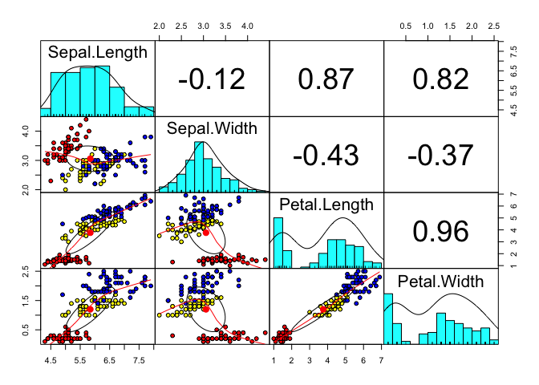
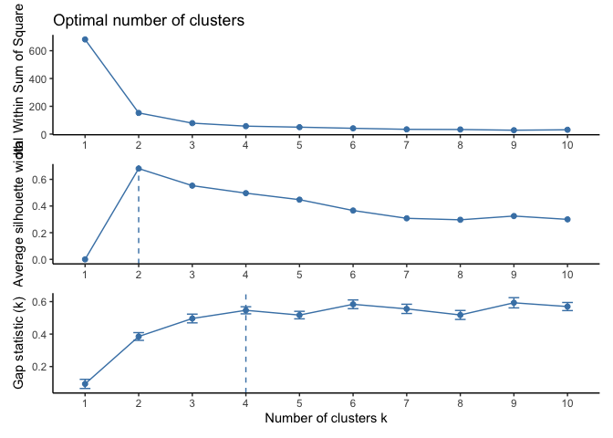

K-means
================
Santiago Casanova, Mateo Guajardo y Raúl Pineda
2023-12-14

### ¿Qué es K-means?

Primero, comenzaremos definiendo que es un $\textit{cluster}$. Aunque no
hay una definición exacta, nosotros vamos a dar una idea un poco general
de lo que este termino engloba. Un $\textit{cluster}$, en el contexto de
análisis de datos y estadística, es un conjunto de elementos que
comparten características similares. En otras palabras, es un grupo de
datos que se parecen entre sí más de lo que se parecen a datos de otros
grupos. La definición completa de un cluster involucra varios aspectos
clave:

1.  Similitud: Los elementos dentro de un cluster son similares entre
    sí. Esta similitud suele medirse en términos de distancia (como la
    distancia euclidiana) o correlación, dependiendo del tipo de datos y
    del método de clustering utilizado.
2.  Homogeneidad Interna: Dentro de un cluster, los elementos deben ser
    lo más homogéneos posible. Esto significa que comparten un grado
    significativo de características comunes, lo que los hace agruparse.
3.  Heterogeneidad Externa: Los elementos de diferentes clusters deben
    ser claramente distintos y deben tener diferencias significativas
    entre los grupos.
4.  Formación Espontánea: En muchos métodos de clustering, como k-means,
    los clusters se forman de manera orgánica a partir de los datos, sin
    intervención externa en términos de definir las características del
    cluster.
5.  Propósito de Análisis: Un cluster se forma generalmente con el
    propósito de realizar algún tipo de análisis de datos. Esto puede
    ser para entender mejor la estructura subyacente de los datos, para
    la toma de decisiones, para la segmentación de mercado, entre otros.
6.  Variedad de Aplicaciones: El clustering se utiliza en una amplia
    gama de campos, desde la biología (agrupación de genes o especies)
    hasta el marketing (segmentación de clientes) y la geografía
    (agrupación de ubicaciones geográficas con características
    similares).

En resumen, un cluster es un grupo de elementos que son
significativamente similares entre sí y diferentes de los elementos en
otros grupos, formados con el objetivo de analizar o entender los datos
de una manera más estructurada y significativa.

K-means es un algoritmo de aprendizaje no supervisado que se utiliza
para agrupar datos en $k$ número de clusters. Es particularmente útil
cuando tienes un conjunto de datos y quieres identificar patrones o
grupos subyacentes en él. La “$k$” en k-means representa el número de
clusters que quieres formar.

El algoritmo funciona asignando puntos a clusters de tal manera que la
suma de las distancias cuadradas entre los puntos de datos y el
centroide (punto central) de su cluster sea mínima. En otras palabras,
el objetivo es minimizar la varianza dentro de cada cluster.
Matemáticamente lo podemos escribir como:

$$ \min_{S} \sum_{i=1}^{k} \sum_{x \in S_i} \| x - \mu_i \|^2 $$

Donde:

1.  $k$ es el número de clusters.
2.  $S = \{S_1, S_2, ... , S_k\}$ es el conjunto de todos los clusters.
3.  $x$ representa los puntos de datos en el espacio.
4.  $\mu_i$ es el centroide del cluster $S_i$.
5.  $\| x - \mu_i \|^2$ es la distancia cuadrada euclidiana entre un
    punto $x$ y el centroide $\mu_i$.

### Algoritmo

Los pasos del algoritmo de K-means son los siguientes:

1.  Inicialización: Se seleccionan al azar $k$ puntos como centroides
    iniciales.
2.  Asignación: Cada punto del conjunto de datos se asigna al centroide
    más cercano.
3.  Actualización: Se recalcula el centroide de cada cluster como el
    promedio de todos los puntos asignados a ese cluster.
4.  teración: Los pasos 2. y 3rau. se repiten hasta que los centroides
    no cambien significativamente entre iteraciones sucesivas o se
    alcance un límite de iteraciones.

### Supuestos

Los supuestos de K-means son:

1.  La varianza de la distribución de cada variables es esférica
2.  Todas las variables tienen la misma varianza
3.  Cada cluster tiene aproximadamente el mismo número de observaciones

### Ejemplo de K-means aplicado

Para nuestro ejemplo, utilizaremos el dataset iris en cada paso. Este
dataset describe las características (largo y ancho de pétalos y
sépalos) de una muestra de 3 tipos diferentes de flores. En realidad ya
conocemos que representa cada dato, sin embargo para el ejercicio
supondremos que son datos no etiquetados. Veamos la distribución de los
datos para nuestras especies.

``` r
require(psych)
pairs.panels(iris[,-5],
             gap = 0,
             bg = c("red", "yellow", "blue")[iris$Species],
             pch=21)
```

<!-- -->

En esta gráfica podemos ver que en todos los casos se mezclan al menos
dos de nuestras especies mientras que la tercera parece mantenerse en su
propio cluster.

Para decidir nuestro número de clusters utilizaremos:

1.  La suma de cuadrados interior (wss), la cual nos indica la
    homogeneidad interna y similitud de los datos.

2.  El score silueta que nos ayuda a identificar la heterogeneidad
    externa y homogeneidad interna la mismo timepo. Este se define como
    $SS = \frac{1}{n}\Sigma_{i=1}^n \frac{max(a_i,b_i)}{a_i-b_i}$ donde
    $a_i$ es la distancia intra cluster promedio del punto $i$ y $b_i$
    es la distancia promedio a todos los puntos del cluster mas cercano.

3.  La estadística de gap intracluster representa la heterogeneidad
    externa de manera probabilistica y se define como la desviacion del
    rango de los clusters de su valor esperado. Se puede leer mas al
    respecto en \[1\].

Veamos ahora como se ven estas métricas en nuestro ejemplo.

``` r
require(factoextra)
require(patchwork)

silhouette <- fviz_nbclust(iris[,-5], kmeans, method = "silhouette")+ 
  theme_classic()+
  theme(
    plot.title = element_blank(),
    axis.title.x =  element_blank()
  )

gap_stat <- fviz_nbclust(iris[,-5], kmeans, method = "gap_stat") +
  theme_classic()+
  theme(plot.title =  element_blank())
  
  
wss <- fviz_nbclust(iris[,-5], kmeans, method = "wss")+
  theme_classic()+
  theme(
    axis.title.x =  element_blank()
  )

wss/silhouette/gap_stat
```

<!-- -->

Para el caso de suma de cuadrados interior, buscamos un punto “codo”. Es
decir, donde la pendiente tiene cambios drásticos. Este los podemos
identificar en $k = 2$ o $k= 3$.

Para el score silueta y el gap, buscamos maximizar el valor. Vemos que
esto se da en $k = 2$ para el score silueta y $k= 4$ para la estadística
gap. Esto nos deja con resultados inconclusos.

Si tomamos $k=2$, la estadística gap toma un valor lejano al máximo,
mientras que si tomamos $k=3$ estaríamos haciendo un compromiso con el
score silueta. Sabemos de antemano que tenemos 3 especies diferentes
pero es interesante ver los resultados de aprendizaje no supervisado.

Realizaremos ahora el análisis de clustering y lo compararemos con la
descomposición en componentes prncipales (para poderlo visualizar en 2
dimensiones).

``` r
library(tidyverse)
pca <- prcomp(iris[,-5])

PCA_data <- pca$x %>% 
  bind_cols(species=iris[,5])


pca_plot <- ggplot(PCA_data, aes(PC1, PC2, color = species))+
  geom_point()+
  theme_minimal()+
  labs(
    color = 'Especie'
  )

kmeans_2 <- kmeans(iris[,-5], 2)

kmeans2_plot <- fviz_cluster(kmeans_2, data = iris[,-5], 
             palette = c("#FC4E07", "#00AFBB", "#E7B800"), 
             geom = 'point',
             ellipse.type = "euclid",
             # star.plot = TRUE, 
             repel = TRUE, 
             ggtheme = theme_minimal())

ggsave('kmeans2.png', device= 'png', dpi = 'retina',
       units = 'cm', width = 20, height = 18)


kmeans_3 <- kmeans(iris[,-5], 3)

kmeans3_plot <- fviz_cluster(kmeans_3, data = iris[,-5], 
             palette = c("#FC4E07", "#00AFBB", "#E7B800"), 
             geom = 'point',
             # ellipse.type = "norm",
             # star.plot = TRUE, 
             repel = TRUE, 
             ggtheme = theme_minimal())

pca_plot + kmeans2_plot +kmeans3_plot
```

<!-- -->

### Bibliografía

\[1\] R. Tibshirani, G. Walther, and T. Hastie (Standford University,
2001).$\textit{Estimating the number of clusters in a data set via the gap statistic.}$
<http://web.stanford.edu/~hastie/Papers/gap.pdf>
